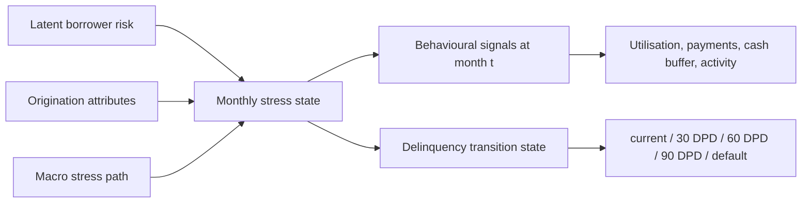

# Data Card

## Dataset

This project uses a synthetic account-month credit monitoring panel generated by `python -m src.data_panel`.

The panel is synthetic by design. Public single-snapshot credit datasets are not sufficient for an early-warning system because the method needs the same accounts observed month after month. The generator creates a reproducible panel with behavioural deterioration paths and writes only information known at each observation month.

## Generation

- Seed: `42`
- Accounts: `2,500`
- Monthly observations per account: `36`
- Observation window: `2020-01-31` to `2022-12-31`
- Output path: `data/panel/account_month_panel.csv` (git-ignored)

Generated status mix:

- `84,689` current rows
- `596` 30 DPD rows
- `413` 60 DPD rows
- `355` 90 DPD rows
- `3,947` default rows

## Generative Process

The generator embeds pre-delinquency pressure before some first `30+ DPD` events. That pressure affects contemporaneous behavioural signals such as utilisation, payment coverage, and cash buffer. The hidden simulated event month is not written to the panel.

## Timing Discipline

The raw panel does not expose hidden simulation event dates. Target construction happens later by looking forward from each account-month row.

For observation month `t`:

- Features use data available up to and including `t`.
- Labels use only months `t+1` through `t+6`.
- Rows without a complete six-month future window are excluded from modelling.

## Intended Use

The data is appropriate for demonstrating:

- Account-month panel construction.
- Point-in-time feature engineering.
- Forward-looking early-warning labels.
- Time-based model validation.
- Watchlist and lead-time evaluation.

It is not appropriate for estimating real portfolio default rates, capital requirements, IFRS 9 provisions, or production credit decisions.

## Limitations

The synthetic data intentionally embeds pre-delinquency behavioural drift, so model performance is expected to be stronger than it would be on noisy real bank data. The value of the project is the methodology, timing discipline, and evaluation design rather than the absolute level of performance.
