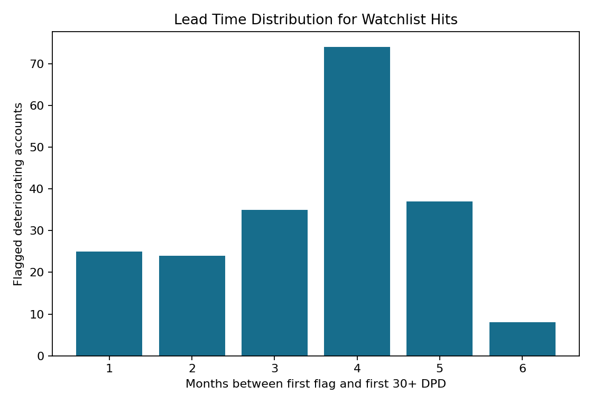
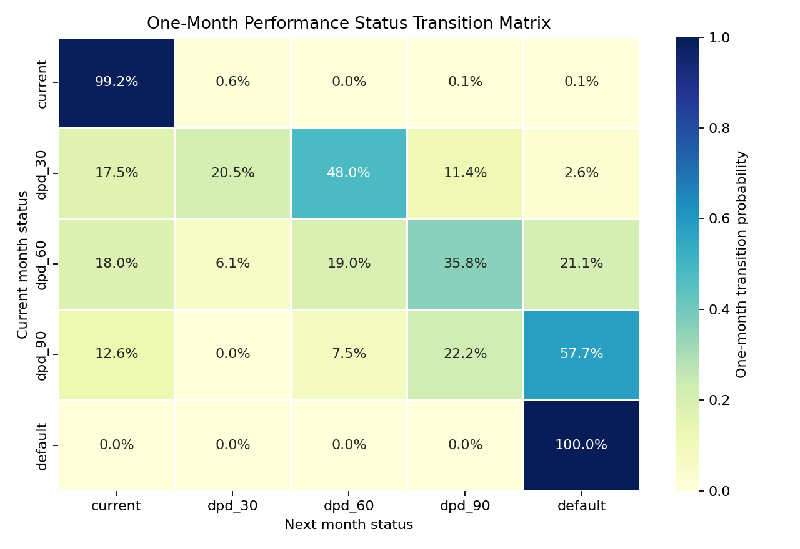
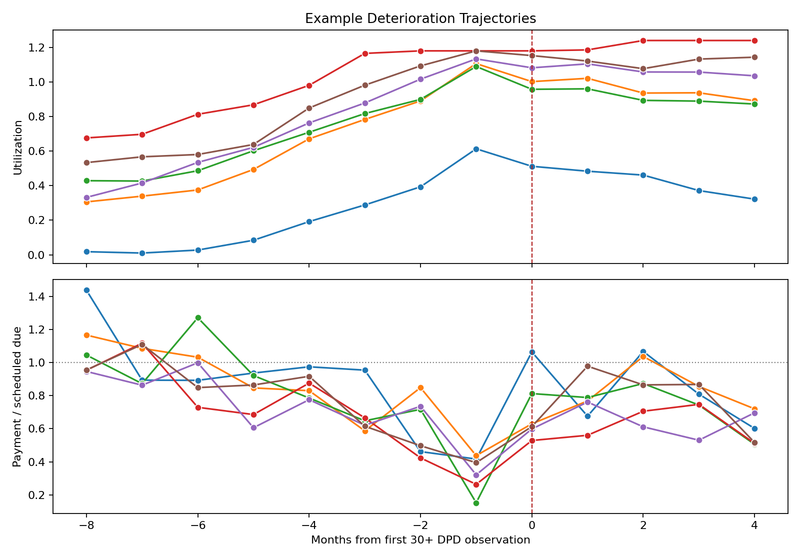
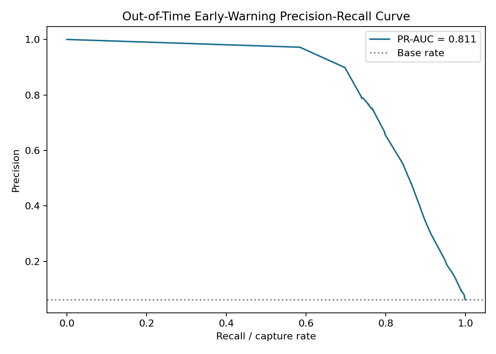
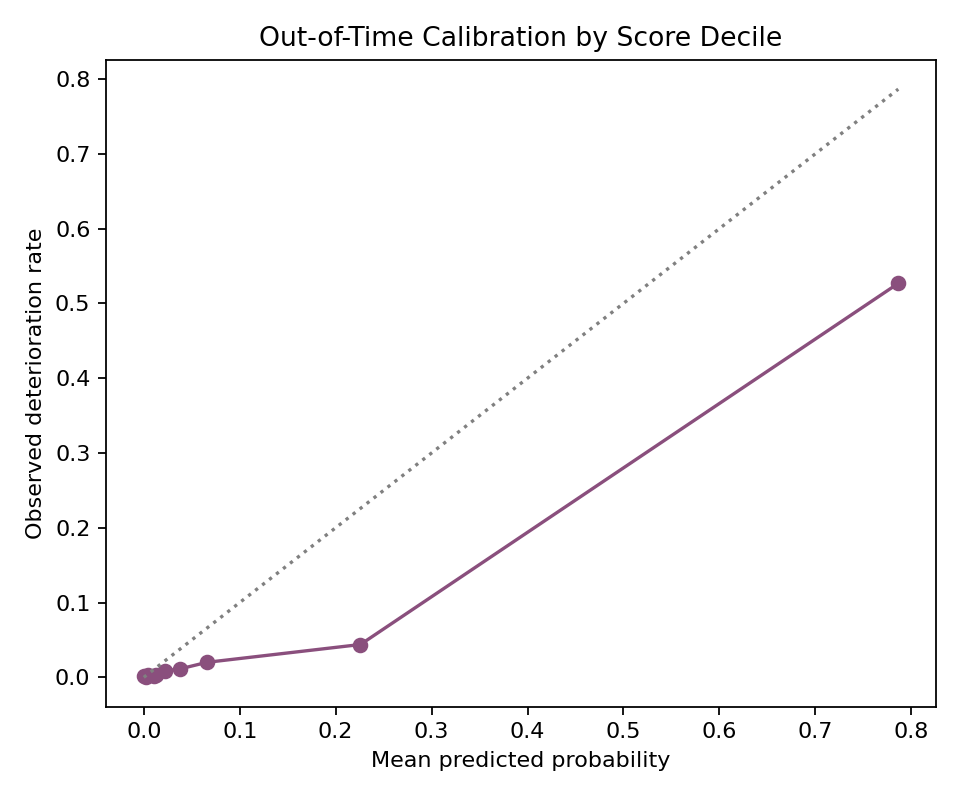
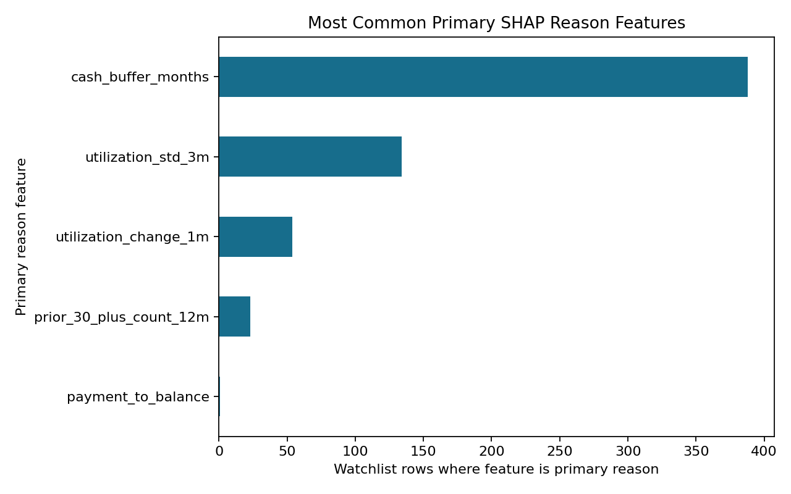

# Credit Early-Warning System

Predicts which currently-performing loans are sliding toward deterioration before they become delinquent, using behavioural trend signals on an account-month panel. The output is a ranked watchlist with lead-time analysis and officer-facing reason codes, framed around IFRS 9 staging / SICR.

## Headline Result

Flags deteriorating accounts a median of `4.0` months before they hit `30+ DPD`, capturing `78.68%` of true deteriorating accounts in the out-of-time test window at monthly precision@`100 = 92.00%`.



## Phase 0 Scope

This project is an early-warning monitoring model, not an origination scorecard.

- Observation cadence: monthly account snapshots.
- Eligible population: accounts that are currently performing at observation month `t`.
- Warning horizon: the six months after observation, `t+1` through `t+6`.
- Deterioration event: first migration to `30+ days past due` or worse during the horizon.
- Timing wall: all features must use information available up to and including month `t`; labels must use only months after `t`.
- IFRS 9 framing: the model is treated as one data-driven SICR signal that could feed a governed Stage 1 to Stage 2 review. It is not a complete IFRS 9 staging policy.

The default data approach is a reproducible synthetic account-month panel with documented deterioration paths. This avoids fabricating results while keeping the project public, runnable, and point-in-time auditable.

## How It Will Work

1. Account-month monitoring panel.
2. Forward-looking deterioration target with strict point-in-time discipline.
3. Behavioural trend features: utilisation momentum, payment behaviour, volatility, and delinquency onset signals.
4. Calibrated early-warning model evaluated on later observation months.
5. IFRS 9 / SICR mapping.
6. Ranked watchlist, lead-time analysis, and reason codes.

## Synthetic Panel

Phase 1 builds the monitoring panel with:

```bash
python -m src.data_panel
```

Latest generated panel summary:

- Rows: `90,000`
- Accounts: `2,500`
- Observation window: `2020-01-31` to `2022-12-31`
- Months per account: `36`
- Accounts ever reaching `30+ DPD`: `449` (`17.96%`)
- Status rows: `84,689 current`, `596 dpd_30`, `413 dpd_60`, `355 dpd_90`, `3,947 default`

The generated CSV and metadata are written under `data/panel/`, which is git-ignored. Re-run the command above to recreate them from seed `42`.

## Transition Behaviour

Phase 2 calculates one-month state migrations and example deterioration trajectories:

```bash
python -m src.eda
```

Latest generated transition summary:

- One-month transitions analysed: `87,500`
- Current to `30+ DPD` roll rate: `0.79%` per month
- Current to current persistence: `99.21%`
- `30 DPD` cure rate to current: `17.51%`
- `30 DPD` worsening rate to `60+ DPD/default`: `62.00%`



The example trajectory plot shows the intended leading-indicator pattern in the synthetic panel: utilisation tends to rise before the first `30+ DPD` observation, while payment-to-due ratios weaken before delinquency.



## Early-Warning Target

Phase 3 creates the labelled modelling population:

```bash
python -m src.target
```

Timing convention:

- Population: rows where the account is current at observation month `t`.
- Label window: months `t+1` through `t+6`.
- Positive label: first migration to `30+ DPD` or worse inside that future window.
- Exclusion: rows without a complete six-month future window are not used for modelling.

Latest target summary:

- Eligible performing account-month rows: `72,004`
- Positive six-month deterioration rows: `2,558`
- Positive rate: `3.55%`
- Accounts with at least one positive labelled row: `449`
- Labelled observation window: `2020-01-31` to `2022-06-30`
- Median months to deterioration among positive rows: `4.0`

## Behavioural Trend Features

Phase 4 creates the point-in-time feature matrix:

```bash
python -m src.features
```

Feature timing convention:

- Rolling windows use account history up to and including observation month `t`.
- One-month changes compare `t` against `t-1`.
- Prior-delinquency history uses only months before `t`.
- Forward target fields are preserved as labels but are excluded from `reports/tables/feature_columns.txt`.

Latest feature summary:

- Feature matrix rows: `72,004`
- Accounts: `2,500`
- Model feature columns: `70`
- Behavioural trend/window feature columns: `33`
- Positive target rate: `3.55%`

Core trend families include utilisation slope, payment-to-due slope, cash-buffer change, purchase-volatility, missed-minimum-payment counts, and prior delinquency recency.

## Early-Warning Model

Phase 5 trains and evaluates the calibrated model:

```bash
python -m src.model
```

Method:

- Model: XGBoost gradient-boosted classifier.
- Imbalance handling: positive-class weight from the training window.
- Calibration: isotonic regression fitted only on the calibration window.
- Split: train on `2020-01-31` to `2021-06-30`, calibrate on `2021-07-31` to `2021-12-31`, test on `2022-01-31` to `2022-06-30`.

Out-of-time test result:

- Test rows: `13,440`
- Test positives: `835`
- Test base rate: `6.21%`
- ROC-AUC: `0.9597`
- PR-AUC: `0.8107`
- Brier score: `0.0350`
- Log loss: `0.1450`

The ranking performance is strong because the synthetic data intentionally embeds visible pre-delinquency behavioural drift. The highest score decile still overpredicts observed deterioration, so the probabilities should be treated as calibrated risk scores rather than a governed IFRS 9 probability-of-default estimate.





## IFRS 9 / SICR Framing

Phase 6 maps the model output into a simplified Stage 2 review signal:

```bash
python -m src.staging
```

Framing:

- Stage 1: performing with no model SICR trigger.
- Stage 2: `30+ DPD` proxy or model score above the SICR review threshold.
- Stage 3: `90+ DPD` credit-impaired proxy.
- The model threshold is the 95th percentile of calibrated scores in the calibration window, not selected on the test labels.

Latest out-of-time SICR signal summary:

- SICR threshold: `0.271186`
- Test rows flagged for Stage 2 review: `1,895` / `14.10%`
- True six-month deteriorations captured by the trigger: `88.74%`
- SICR trigger precision: `39.10%`

This is intentionally described as a review signal. Real IFRS 9 staging is governed, multi-factor, and policy-specific; the model would support that process rather than replace it.

## Watchlist & Lead Time

Phase 7 produces the ranked officer watchlist and lead-time analysis:

```bash
python -m src.watchlist
```

Evaluation setup:

- Period: out-of-time test split only, `2022-01-31` to `2022-06-30`.
- Review capacity: top `100` accounts per month.
- Hit definition: account is current at observation month `t` and reaches `30+ DPD` within the next six months.
- Lead time: months between first watchlist flag and first future `30+ DPD` observation.

Latest watchlist result:

- Watchlist rows: `600`
- Watchlist positive rows: `552`
- Monthly precision@100: `92.00%`
- Deteriorating test accounts captured: `203` of `258` (`78.68%`)
- Median lead time: `4.0` months
- Mean lead time: `3.48` months

## Reason Codes

Phase 8 adds SHAP reason codes to every watchlist row:

```bash
python -m src.explain
```

Latest explanation summary:

- Watchlist rows explained: `600`
- Top primary SHAP reason features:
  - `cash_buffer_months`: `388`
  - `utilization_std_3m`: `134`
  - `utilization_change_1m`: `54`
  - `prior_30_plus_count_12m`: `23`
  - `payment_to_balance`: `1`

The reason-code table is written to `reports/tables/watchlist_reason_codes.csv`. These reasons are model explanations, not causal claims.



## How To Run

Recommended one-command run:

```bash
pip install -r requirements.txt
python -m src.pipeline
```

Individual phase commands:

```bash
python -m src.data_panel
python -m src.eda
python -m src.target
python -m src.features
python -m src.model
python -m src.staging
python -m src.watchlist
python -m src.explain
```

Run tests:

```bash
python -m pytest tests
```

## Caveats

- The initial implementation will use synthetic data, clearly labelled as synthetic.
- Synthetic data is useful for demonstrating timing discipline and modelling workflow, but it cannot validate real portfolio performance.
- Real IFRS 9 staging is governed, multi-factor, and policy-specific. This project models one quantitative early-warning signal that would support, not replace, that process.
